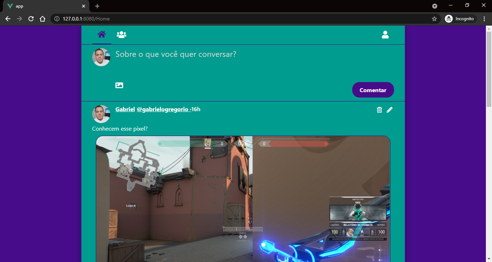
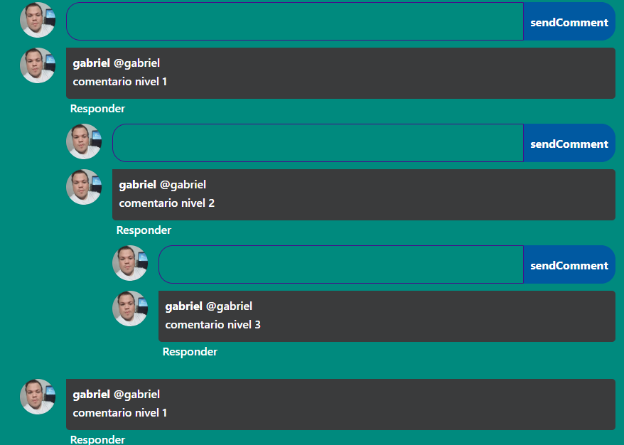
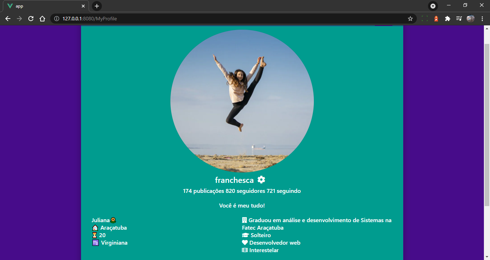
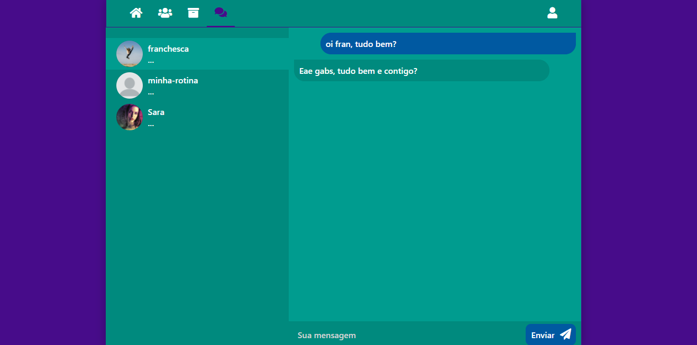

<div align="center">
  
  
  
  
  
</div>
 
<div align="center">    
  


</div>   


<h2 align="center">A Rede Social</h2>

<p align="center">
  Uma micro rede social<br/>
  <a href="https://rede-social-frontend-000.herokuapp.com/Home"><strong>Acessar Site</strong></a>
  <br>
  <br>
  <a href="https://github.com/gabrielogregorio/Rede-Social/issues/new?template=bug_report.md">Reportar bug</a>
  ·
  <a href="https://github.com/gabrielogregorio/Rede-Social/issues/new?template=feature_request.md">Solicitar Recursos</a>
</p>

<h3>Informações gerais</h3>
Este projeto se trata de uma rede social, desenvolvido usando um backend feito em nodejs coberto com TDD e o frontend em VueJs. O deploy da aplicação está feito no Heroku.

## Configuração do arquivo de ambiente
É preciso configurar o arquivo de ambiente para apontar para a API(backend) de desenvolvimento, conforme o [repositório do backend](https://github.com/gabrielogregorio/Social-Network-Backend)
```
# Ambiente local/desenvolvimento
http://localhost:3000
```

## Execução do frontend
Para executar o frontend é preciso ter conhecimentos em VueJs3, então instalar as dependências com o comando 'npm install' e por fim o comando 'npm run serve'. A aplicação será colocada no ar na porta 8080.


#### Backend

Para executar o backend é preciso instalar o Mongodb no seu computador e seguir [este repositório](https://github.com/gabrielogregorio/Social-Network-Backend)

# Algumas imagens
### Tela inicial


### Sistema de comentários


### Conta do usuário


### Sistema de mensagens

