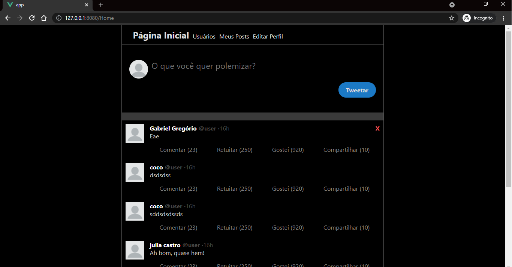

  
  

  
  
  
  
  

<h3 align="center">Uma micro rede social feita com nodejs e vuejs. O backend está coberto com TDD</h3>

Isso é basicamente uma micro rede social, ainda em alpha e sendo focado principalmente nos meus estudos,
   

<h3>Informações gerais</h3>
Um aviso importante, atualmente minha preocupação é com o backend, portanto no front end eu só estou fazendo o dever de casa e para desktop, pois o backend é bem mais complexo e é o meu foco.

