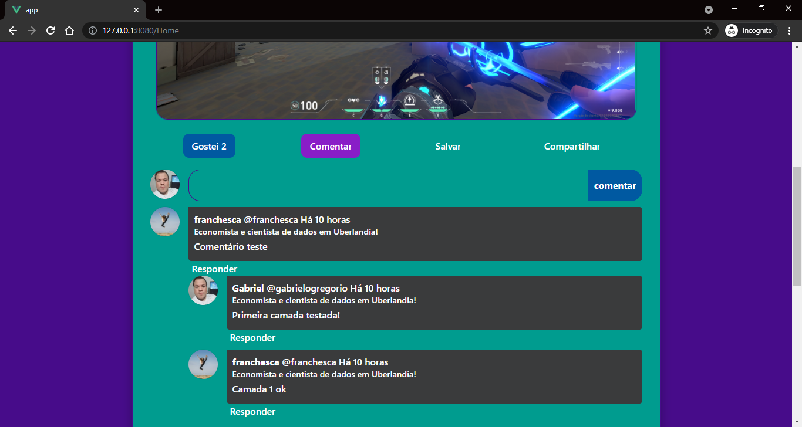

  
  

  
  
  
  
  

<h3 align="center">Rede Social</h3>

  Uma micro rede social feita com nodejs e vuejs. O backend está coberto com TDD
   
  <a href="https://gabrielogregorio.com/projetos/Rede-Social/"><strong></strong></a>
   
   
  <a href="https://github.com/gabrielogregorio/Rede-Social/issues/new?template=bug_report.md">Reportar bug</a>
  ·
  <a href="https://github.com/gabrielogregorio/Rede-Social/issues/new?template=feature_request.md">Solicitar Recursos</a>

<h3>Informações gerais</h3>

<h3>Informações gerais</h3>
Um aviso importante, este é um projeto para portifólio e questões como arquiteturas mirabolantes ou sofisticadas não estão sendo levadas em conta, estou fazendo o básico para colocar esse projeto para funcionar e aprendendo conforme desenvolvo.

### Tela inicial

### Sistema de comentários - beta

### Conta do usuário

### Sistema de mensagens

